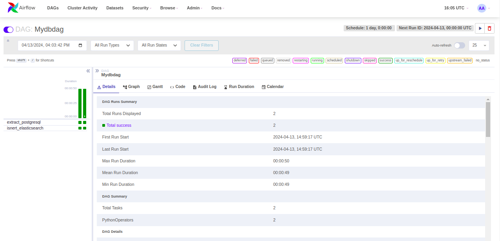
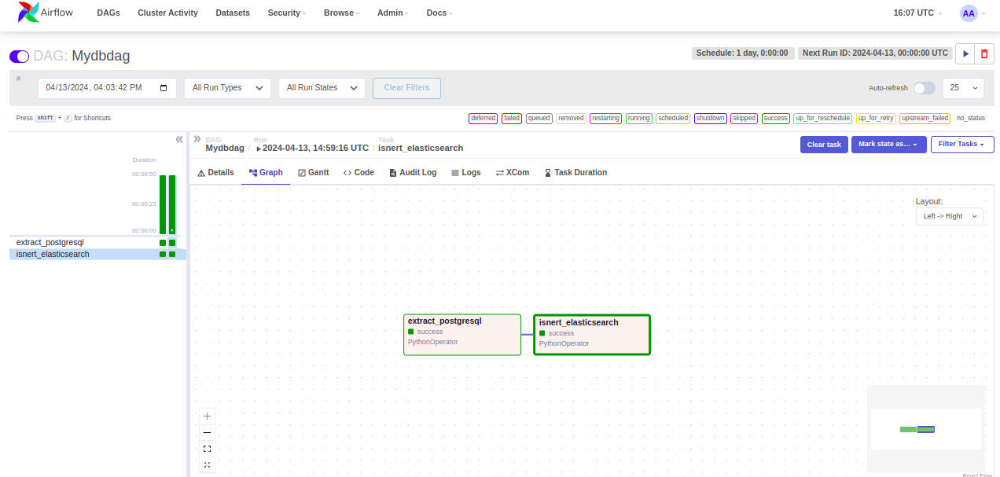
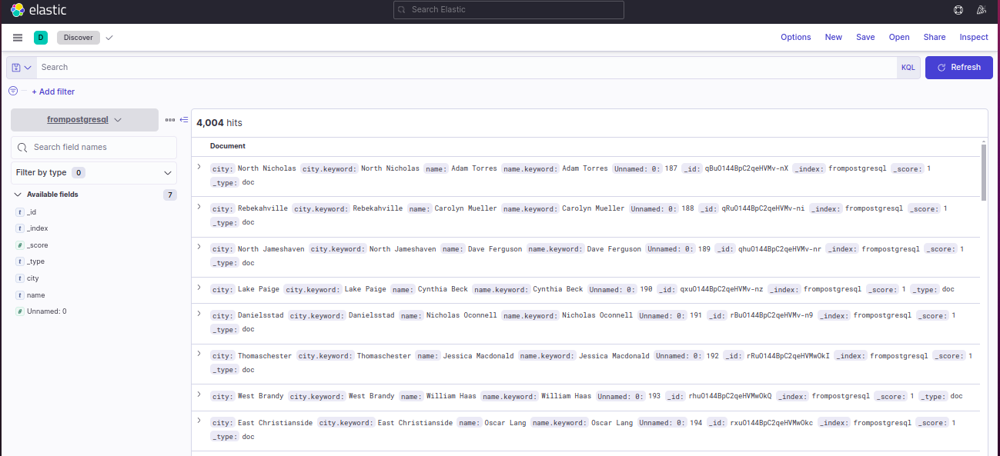

# Mydbdag - Airflow DAG for Extracting and Loading Data

## Project Overview

"Mydbdag" is an Apache Airflow Directed Acyclic Graph (DAG) designed to automate the process of extracting data from a relational PostgreSQL database and loading it into an Elasticsearch index. This project streamlines the ETL (Extract, Transform, Load) process, making data ingestion into Elasticsearch seamless and efficient.

## Project Structure

The project is structured as follows:

```
data-pipeline-airflow-elasticsearch/
│
├── dags/
│   └── Mydbdag.py                  # Airflow DAG definition file
│
├── logs/
│   └── task1.log                   # Log file for task 1
│   └── task2.log                   # Log file for task 2
│
├── screenshots/
│   └── dag_ui.png                  # Screenshot of the Airflow DAG UI
│   └── dag_tasks_graph.png         # Screenshot of the tasks graph in the Airflow DAG UI
│   └── elastic_index_records.png   # Screenshot of the Elasticsearch index records
├── scripts/
│   └── mydbdag_task1.py            # Script for extracting data from PostgreSQL and saving as CSV
│   └── mydbdag_task2.py            # Script for loading extracted data into Elasticsearch
│
└── README.md                       # Project README file
```

## Usage

1. Clone the repository to your local machine:

   ```bash
   git clone https://github.com/mkgmels/Data-Engineering-Portfolio.git
   ```

2. Install Apache Airflow following the [official installation instructions](https://airflow.apache.org/docs/apache-airflow/stable/installation/index.html).

3. Install the required Python packages:

   ```bash
   pip install psycopg2 elasticsearch
   ```

4. Copy the DAG file (`Mydbdag.py`) to the Airflow DAGs directory.

5. Start the Airflow webserver and scheduler:

   ```bash
   airflow webserver 
   airflow scheduler
   ```

6. Access the Airflow UI in your web browser (usually at `http://localhost:8080`) to view and trigger the "Mydbdag" DAG.

## Screenshots

Below are some screenshots of the "Mydbdag" DAG in the Airflow UI:

- **DAG UI**:
  

- **Tasks Graph**:
  

- **Elasticsearch index records**:
  
  
  
